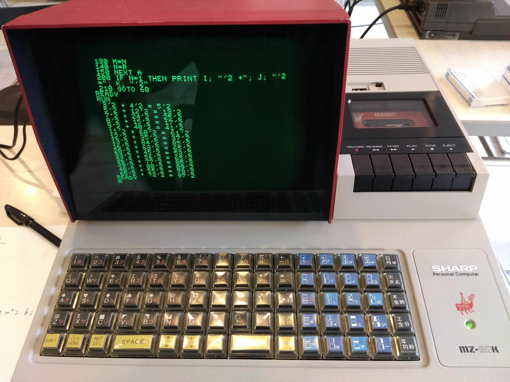

# Past Lab
[過去環境ラボ](https://www.facebook.com/groups/294793114666557/) by 未来環境ラボ

## Documents
各機種の起動および使用方法についてのメモです。
- [パーソナル コンピュータ (PC)](docs/PCs)

## Source Code
展示および写経を主な目的として、10 行程度で記述できるコードを多く揃えました。

- [BASIC のコードおよびその説明](src/BASIC)
  - 円周率 π
  - 立方根 (3乗根)
  - ピタゴラス数 など

SHARP MZ-80K でピタゴラス数を求める:  

### References
- [過去環境ラボ (Facebook グループ)](https://www.facebook.com/groups/294793114666557/)

### Records
- 2018.11.09-10 京都コンピュータ学院 11月祭 「過去環境ラボ」
