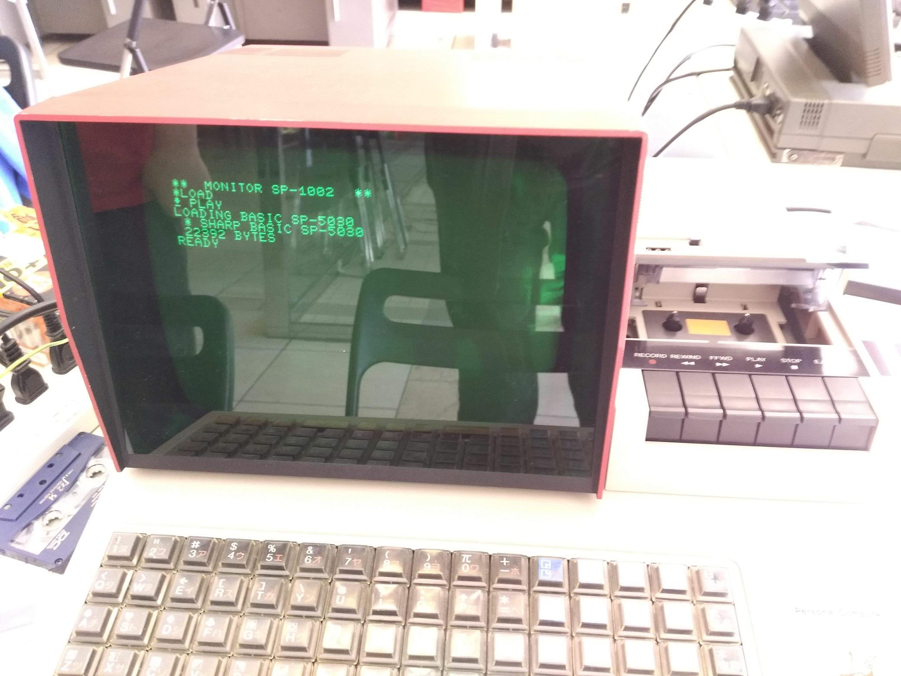

# SHARP MZ-80K
[MZ-80 - Wikipedia](https://ja.wikipedia.org/wiki/MZ-80)

## BASIC の起動方法
カセットテープから BASIC を読み込みます。

- BASIC のカセットテープをカセットデッキにセットする
- 電源を入れる
- `LOAD` を入力して CR キーを押す
- カセットデッキの PLAY ボタンを押す
- `READY` が表示されたら完了
  - カセットテープを取り出してもよい

