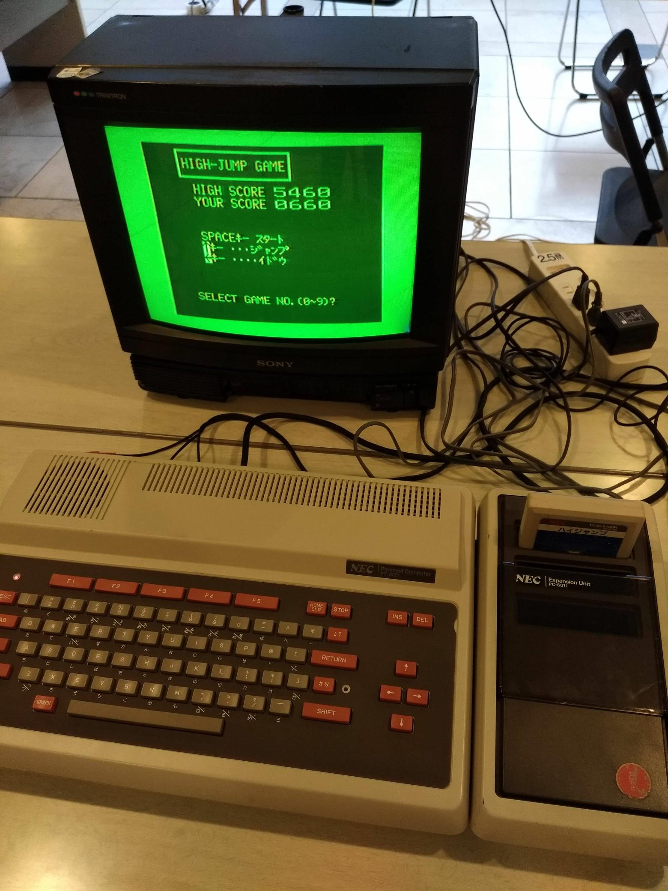

# NEC PC-6001
[PC-6000シリーズ - Wikipedia](https://ja.wikipedia.org/wiki/PC-6000%E3%82%B7%E3%83%AA%E3%83%BC%E3%82%BA)

## PC のセットアップ
- PC-6001 本体
- ディスプレイ
  - RCA 端子で接続
  - テレビなど
- テープレコーダー (オプション)

## BASIC の起動方法
N60-BASIC が標準搭載されているため、電源を入れるだけです。

```
How Many Pages?
```

が表示されたら RETURN キーを押します。

- 「How Many Pages」は「使用ページ数」を表す
  - ソフトウェアで指定されている場合はその数字を入力する
- 画面下の `CLOAD`, `RUN` などは、F1～F5 キーに対応する
  - `LIST` (F4) で現在のプログラムを一覧表示
  - `RUN` (F5) で現在のプログラムを実行
  - SHIFT キーを押すと、別のコマンドに切り替え
- 実行中のプログラムを停止 (Break) するには、STOP キーを押す

## ゲームの起動方法
ゲームにより、カートリッジから読み込むもの、カセットテープから読み込むもの、その両方を使うものがあります。

### ハイジャンプ
カートリッジから読み込みます。  
カートリッジをセットして電源を入れるだけです。



### 地獄の黙示録
以下の手順により、カセットテープから読み込みます。

- カセットテープをテープレコーダーにセットする
- 電源を入れる
- `How Many Pages?` が表示されたら `2` を入力して RETURN キーを押す
- `CLOAD` または `CLOAD"99"` を入力して RETURN キーを押す
- テープレコーダーの PLAY ボタンを押す
- `Found 99`, `Ok` が表示されたら F5 キーを押す
- スペース キーを押す

### オリオン／クエスト
カセットテープには、「オリオン」「クエスト」という 2 つのゲームが収録されています。  
このほかに、ROM/RAM カートリッジ (PC-6006) を使います。

#### オリオン
- ROM/RAM カートリッジをセットする
- カセットテープをテープレコーダーにセットする
- 電源を入れる
- `How Many Pages?` が表示されたら `2` を入力して RETURN キーを押す
- `CLOAD` または `CLOAD"Olion4"` を入力して RETURN キーを押す
- テープレコーダーの PLAY ボタンを押す
- `Found Olion4`, `Ok` が表示されたら F5 キーを押す
- タイトル画面が表示されたら RETURN キーを押す

#### クエスト
「オリオン」と同様ですが、次の部分が異なります。
- `How Many Pages?` が表示されたら `1` を入力して RETURN キーを押す
- `CLOAD"Quest4"` を入力して RETURN キーを押す

「クエスト」は「オリオン」の次に収録されているため、テープを途中から再生してもかまいません。
