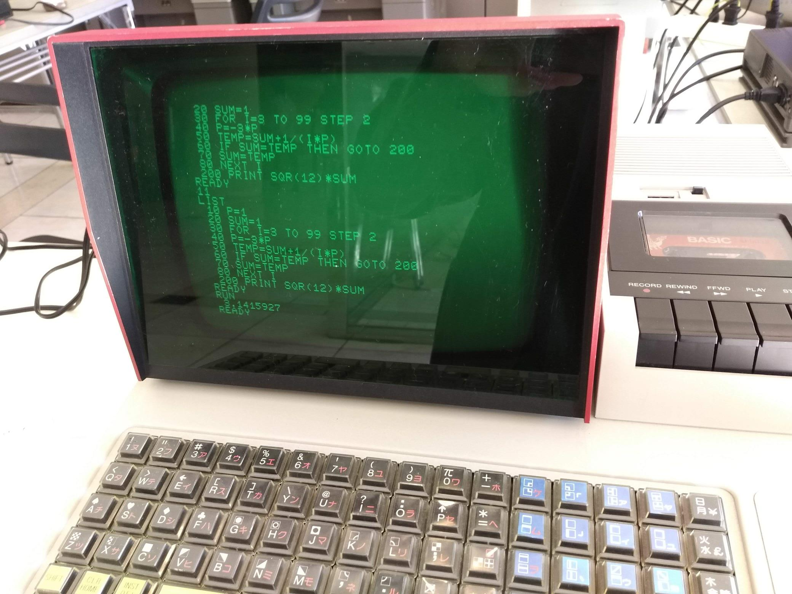

## BASIC
展示および写経を主な目的として、10 行程度で記述できるコードを多く揃えました。

### Sample Code
これらのコードは、[Applesoft BASIC in JavaScript](https://www.calormen.com/jsbasic/) のような BASIC シミュレーター上でも実行できます。

- [バブルソート](BubbleSort.bas)
- [立方根 (3乗根)](CubicRoot.bas)
  - ニュートン法による漸化式を利用
  - `y = (2*x+a/(x*x))/3`
- [最大公約数 (GCD)](GCD.bas)
  - ユークリッドの互除法を利用
- [円周率 π](Pi.bas)
  - `π = √12 (1/1·1 - 1/3·3 + 1/5·3^2 - 1/7·3^3 + …)`
- [ピタゴラス数](PythagoreanTriples.bas)
  - 最大公約数をチェックすることで、素なもののみに絞り込む
- [sin 関数](Sine.bas)
  - マクローリン展開を利用
  - `sin x = x - x^3/3! + x^5/5! - x^7/7! + …`

### References
- [BASIC - Wikipedia](https://ja.wikipedia.org/wiki/BASIC)
- [BASIC - Wikibooks](https://ja.wikibooks.org/wiki/BASIC)
- [ニュートン法](https://ja.wikipedia.org/wiki/%E3%83%8B%E3%83%A5%E3%83%BC%E3%83%88%E3%83%B3%E6%B3%95)
- [ユークリッドの互除法](https://ja.wikipedia.org/wiki/%E3%83%A6%E3%83%BC%E3%82%AF%E3%83%AA%E3%83%83%E3%83%89%E3%81%AE%E4%BA%92%E9%99%A4%E6%B3%95)
- [円周率](https://ja.wikipedia.org/wiki/%E5%86%86%E5%91%A8%E7%8E%87)
- [ピタゴラスの定理](https://ja.wikipedia.org/wiki/%E3%83%94%E3%82%BF%E3%82%B4%E3%83%A9%E3%82%B9%E3%81%AE%E5%AE%9A%E7%90%86)
- [テイラー展開](https://ja.wikipedia.org/wiki/%E3%83%86%E3%82%A4%E3%83%A9%E3%83%BC%E5%B1%95%E9%96%8B)

SHARP MZ-80K で円周率 π を計算:  

